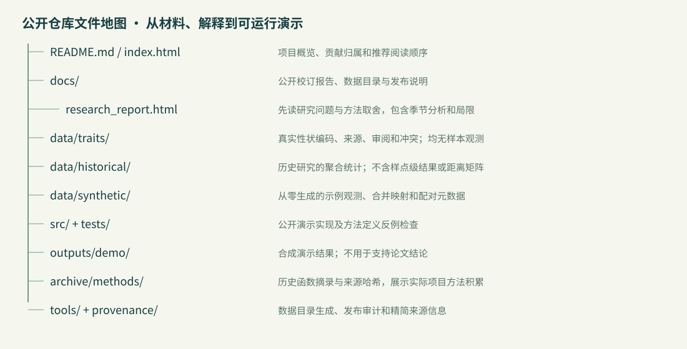

# 大型底栖动物多源数据治理与多维 β 多样性分析

毕业论文项目的公开作品集版本。研究对象为信江鹰潭段大型底栖动物，设计为 **12 个固定点 × 夏秋两季**，最终按 **37 个属级分类单元**分析。重点展示数据质量、证据整合、方法取舍和可审阅的研究流程。

本人主要负责目标与处理规则、来源取舍、异常复核、结果解释和迭代推进；多数代码、图表与报告由 AI/agent 辅助生成。

## 阅读入口

1. [项目可视化入口](index.html)：方法路线、文件结构与材料说明。
2. [自主审阅稿 · 公开校订版](docs/research_report.html)：保留五章结构、季节分析和局限讨论。
3. [逐表数据目录](docs/data_catalog.html) / [按阅读顺序整理的 XLSX](data_catalog.xlsx)：来源、连接键和中文列解释。
4. [发布说明](docs/release_notes.html)：历史版本选择、脱敏处理和公开校订。
5. [历史方法函数](archive/methods/)与[可运行演示](src/demo.py)：分别展示历史积累与本次整理的运行入口。

HTML 可下载后直接用浏览器打开；GitHub 文件页面主要用于查看源码。页面不依赖外部脚本、样式或字体。

## 哪些输入对应哪些方法


| 输入与问题 | 分析选择 | 解释边界 |
|---|---|---|
| 有无数据；比较组成替换与子集化 | Sørensen + Baselga | 周转与嵌套结果不等于任何分解都可使用的标签 |
| 密度或生物量；比较数量结构 | Bray–Curtis 数量分解 | 分开分析两种单位；区分平衡变化与数量梯度 |
| 混合编码性状；保留低丰富度样本 | 加权 Gower → UPGMA 功能树 | 缺失处理与树近似需要记录；不把未知填成零 |
| 高丰富度样本；比较功能空间体积 | PCoA → 凸包敏感性 | 样本类群数大于空间维数；历史四维子集为 11/24 样本 |
| 分子序列覆盖不足 | 分类阶元的单位枝长代理树 | 不代表真实进化时间或分子系统发育距离 |
| 同点两季重复观测 | 受限 PERMANOVA + PERMDISP + BH 校正 | 固定点内置换，24 条记录不是 24 个独立空间样点 |
| 单季节距离和环境/空间变量 | 筛选变量、dbRDA、VPA | 小样本探索性；保留未解释与负调整分区 |

## 数据与可复现范围


- **真实性状资料**：保留自行收集整合的 37×37 性状编码矩阵、来源、审阅和冲突；971 个有效值、398 个缺失。
- **真实研究汇总**：保留历史稿的聚合结果与解释；不会附带样本观测、原始坐标或样点对距离明细。
- **合成运行数据**：固定随机种子从零生成，不读取原研究群落矩阵，也不拟合真实分布。能运行分析流程，不能重现论文数值。
- **历史与公开版本**：报告以历史提交 `05df483` 的用户返修 v4 为底稿；后期稿件和旧 Git 对象没有进入此仓库。本版对早期稿中的系数混用等问题做了有记录的校订。

## 运行合成示例

依赖安装在仓库本地 `.venv`。以下命令在本仓库根目录执行：

```bash
python3 -m venv .venv
.venv/bin/python -m pip install -r requirements.txt
.venv/bin/python src/demo.py
.venv/bin/python tools/build_catalog.py
.venv/bin/python -m unittest discover -s tests -v
.venv/bin/python tools/check_release.py
```

Windows 可将 `.venv/bin/python` 替换为 `.venv\Scripts\python.exe`。

演示完成虚构原始观测、规则合并、三类数据与三维度的 β 分解，以及九个总距离矩阵的配对季节检验。为明确处理非欧氏距离，演示检验显式采用 Lingoes 校正；历史稿的统计输出另行保留，二者不宣称数值一致。环境驱动、TBI 和四维凸包未在此演示入口重做。

## 文件架构



原始矩阵、真实样本级衍生物、内部沟通、第三方文献全文和本机缓存不进入发布目录。`provenance/` 只保存必要的版本来源与文件类别；首次公开提交采用实际整理日期。

## 已知限制与来源归属

性状仍有缺失，存在同属种证据上卷与历史审阅例外；详见来源长表、候选决定和冲突表。分类树为代理，不能替代分子树；函数归档不等于对历史统计实现的完全验证。

来源材料的权利与归属分别属于原作者或数据提供者。本仓库未代授第三方材料许可证，未打包文献全文。项目代码也未添加未经作者选择的开源许可证；公开可见不等于任意再许可。相关说明见 [材料归属](NOTICE.txt)。
